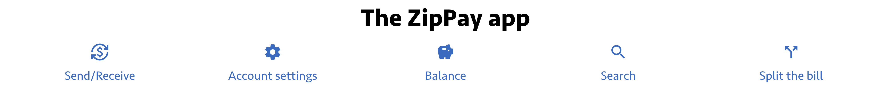

# Front-end Labs

## HTML Exercises

### Zippay App: Home page

When we execute `npm run dev` in this folder we are greeted by a blank page. This is, to say the least, confusing! Let's have a proper home / landing page.

Working in `index.html`:

- Add the basic strcture of an HTML document. Maybe use Emmet shortcuts to help?
- In the `body` of the HTML document, add an `h1` element
  - The content of the element should be `The ZipPay app`.
- Add an `hr` element below it.
- Below the `hr` element, add a paragraph with some placeholder text, maybe lorem ipsum or just "Content will eventually go here."
- All set! Take a look at http://localhost:5173, or whatever port your server opened on, to see the results.

### Home Page: Navbar with Text

You may have noticed that we have a `pages/` folder full of placeholder HTML file. Let's build a navigational list, a navbar, to link to those pages

Working in `index.html`:

- Below the `h1` but above the `hr` add a `nav` element.
- In the `nav` element, add the following lines, separated by `br` tags for line breaks
  - Send/Receive
  - Account settings
  - Balance
  - Search
  - Split the bill
- Check to see that each shows up on a line by itself
- You're done!

### Home Page: Navbar as a list

The navbar lacks semantic meaning. That is, it's just a few lines of text: it could be a poem, a list of pages, or gibberish. We should organize it as a unit.

Working in `index.html`, remove the `br` tags. Make each line a list item in an unordered list. To be clear, there should be _one_ unordered list, with the _five_ list items under it. When you're done, check your page in the browser to see what it looks like.

Note: Eventually, we will do two things: remove the bullets, and lay out the list horizontally. That will happen when we get to CSS. For now, we are working within the limitations of HTML.

### Home Page: Navbar with Links

Our navbar is a little bit limited, in that it does not take the user anywhere. Let's change that.

Working in `index.html`:

- Turn each list item into a link, as follows:
  - Send/Receive: pages/send-receive.html
  - Account settings: pages/account-settings.html
  - Balance: pages/balance.html
  - Search: pages/search.html
  - Split the bill: pages/split-the-bill.html
- You will not be deleting the list items! The links should go _inside_ the list items
- Check to see that the links work and go to the appropriate pages

### Home Page: Semantic updates

The home page needs a little bit more organization:

- The `h1` should be inside a `header`
- We already have the navbar inside a `nav` so we can leave that as-is
- Below the `nav`, add a `main` element. This will be where the main content of the pages goes.
  - Within `main`, add an `h2` with the content "ZipPay Home"
- Below the `main`, add a `footer` with the following information:
  - "Copyright 2024, ZipPay, incorporated."
  - Put an `hr` above this (but still inside the footer) to separate it from the rest of the page.
- Check your page to see that the layout works.

### Balance: Recent Transactions

We want to add a "Recent Transactions" section to the "Balance" page `pages/balance.html`. We will use an HTML table to list recent transactions.

First, we should take care of the basics with respect to layout:

- Copy the header, navbar, and footer over from `index.html`. Place them appropriately within the `body` of the HTML document
- In `main`, add or change the `h2` to read `Balance`
- Below that `h2`, add two `section`s:
  - One with a paragraph that says "Current Balance"
  - The other with an `h3` that says "Recent Transactions"
- Check that the page layout looks the way you would expect it to.

Onto the details... Here's the data set:

```csv
id,payorId,payeeId,datePaid,amount,reason
8,wvancastele6i,mloveguardhr,2022-09-06,51.37,sed tristique
91,wvancastele6i,ddunabie5j,2023-07-23,10.77,nec nisi vulputate
235,wvancastele6i,rbottell93,2024-02-26,79.09,eu tincidunt
494,wvancastele6i,mwallend6,2023-06-12,38.05,nunc donec quis orci eget orci vehicula condimentum curabitur
765,wvancastele6i,pbann7c,2022-06-01,89.99,turpis donec posuere metus vitae ipsum aliquam non mauris
```

We will assume the user is `wvancastele6i`. In the table we want to display:

- The payee (as the userid)
- The payment date
- The amount
- The reason (it's the pseudo-latin lorem ipsum text)

Remember that the structure of a table, generally, is

```html
<table>
	<thead>
		<tr>
			<th>Header for column 1</th>
			<th>Header for column 2</th>
			<th>Header for column 3</th>
		</tr>
	</thead>
	<tbody>
		<tr>
			<td>Data for row 1, column 1</td>
			<td>Data for row 1, column 2</td>
			<td>Data for row 1, column 3</td>
		</tr>
		<tr>
			<td>Data for row 2, column 1</td>
			<td>Data for row 2, column 2</td>
			<td>Data for row 2, column 3</td>
		</tr>
		<!-- And so on -->
	</tbody>
</table>
```

You will need a table headers section, with the column headers, and then a table row for each of the rows of data.

### Send/Receive Payments: Add Form

The Send/Receive Payments `pages/send-receive.html` page is a placeholder. Let's make that better!

First, layout, same as with `pages/balance.html`:

- Copy the header, navbar, and footer over from `index.html`. Place them appropriately within the `body` of the HTML document
- In `main`, add or change the `h2` to read `Send/Receive Payments`
- Check that the page layout looks the way you would expect it to.

Onto the form:

1. In the `main` element, add a `form`. No need for an `action` attribute
2. For each of the below, add a `label` and the appropriate form field (usually an `input` element). Consider wrapping each label+input combo in its own `div`.

- Account
- Recipient
- Amount
- Reason

3. Add a submit button labeled "Send".
4. Check out the form in the browser. Don't worry about the layout, which we will fix soon.

### Send/Receive Payements: Improve form with validations

Let's make the form a little bit better. We will add some validations to the form. After each of the validations, try submitting the form to see if the validation is successful.

1. The "Account" should default to the current user's default account. We don't have that information right now, so you can set the default value to "Default account"
1. The Recipient can't be empty. All of our usernames are at least four characters long. Validate this field
1. The Amount must be positive, have only two decimal places, and be between $0.01 and $1000.00
1. The Reason can't be longer than 255 characters

### Account Settings: Add form

Now that we know forms pretty well, let's add a form all at once. Account settings should have the following:

1. First Name field, required, minimum length 2, alphabetical characters, spaces and dashes only. [The format is a challenge, feel free to come back to it when you get the rest of the form done]
2. Same for Last Name
3. Same for City
4. Add a State/Province field as a drop-down of US states and Canadian provinces. Don't write the drop-down yourself. Search on the internet for something like "html us states select list" and copy and paste that. Add on Canadian provinces as well.
5. Postal Code: This could be challenging
6. Email: Is there a custom field that could be helpful here?
7. Telephone: Similar?
8. Account type: Select from one of "Personal", "Corporate" or "Other". Is there a form widget that could help here? Select "Personal" by default.

## CSS Exercises

### Navbar: Flexbox Layout

Currently, the navbar is a bulleted list, not ideal for a navbar. Let's improve it as follows:

1. Open the file `pages/navbar.html`. We will use this as our baseline. It can be a basic HTML page.
2. If you want a starter version, you can run this command from the `front-end-labs` directory: `git checkout solutions -- pages/navbar.html`
3. Decide whether you want to use an unordered list, or divs, to set up the navbar. Either one will work.

- If you use an unordered list, the `ul` is the container and the `li` elements are the children.
- If you use `div`s, the `nav` element is the container and the `div`s are the children
- You can always copy and paste the navbar from one of the existing pages into `pages/navbar.html`.

4. If you use an unordered list, you'll need to remove the `padding` and the `list-style-type` properties or things will look... weird.
5. Set the container up as a flexbox
6. Set up the children with a `flex` config

Check out the results!

### Send/Receive or Account Settings: Grid Layout

The Send/Receive and Account Settings forms have the functionality we need, but does have any sort of useful or pleasing layout.

1. Pick either pages/account-settings.html, or pages/send-receive.html
2. If you want a starter version, you can run this command from the `front-end-labs` directory: `git checkout solutions -- pages/account-settings.html`
3. Organize the HTML of the form you have chosen so that it will work with a grid. Some questions:

- Does each form element have to be in a div?
- Does each label have to be in a div?
- Do we wrap the form element plus the label into a container div, or leave them as-is?
- Do you see any other particular gotchas?

4. Design a CSS grid for the form. There are many paths to success here.
   A suggestion: think of the grid as two columns, the left column could hold the labels
   The right column could hold the form fields. But there are many possible variations
   and you should do what makes sense to you!
5. See if the grid layout is working in your browser!

## Navbar: Putting it all together.

Take a look at data/navbar-design.png: .

What would we need to build out something like this in pages/navbar.html? Some suggestions:

1. Font from Google (take a look at front-end-demos/pages/css/fonts.html for an example)
2. Icons also from Google (front-end-demos/pages/css/icons.html to see an example of this)
3. Flexbox layout for the content
4. Font size and coloring as well
5. Spacing between elements
6. And when you hover over an icon, it has a different background color
